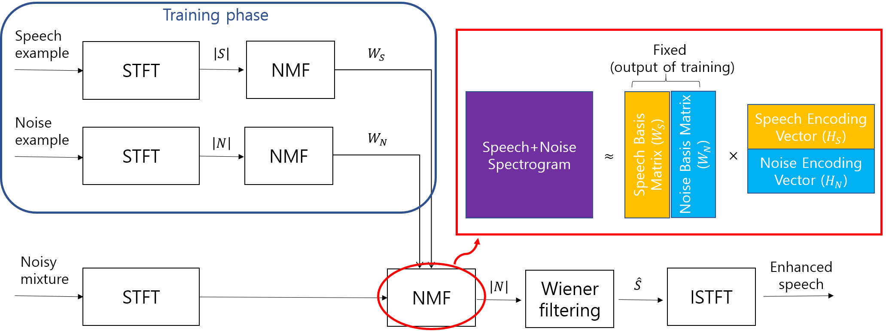
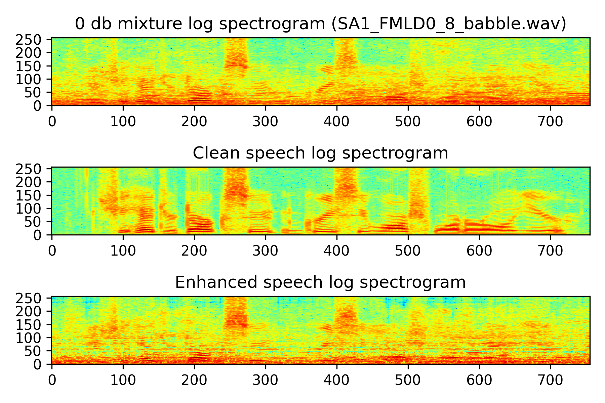

# Source separation (speech enhancement) in Python 3.7
### Separates noisy into clean speech and noise using non-negative matrix factorization (NMF) algorithms.

This code uses non-negative matrix factorization (NMF) algorithms to enhance speech. 

This code is a non-official implementation of the paper:
<br>
[K. Kwon, J. W. Shid and N. S. Kim, "NMF-based source separation utilizing prior knowledge on encoding vector," 2016 IEEE International Conference on Acoustics, Speech and Signal Processing (ICASSP), Shanghai, 2016, pp. 479-483, doi: 10.1109/ICASSP.2016.7471721.](https://ieeexplore.ieee.org/document/7471721)  
(Document: https://sapl.gist.ac.kr/wp-content/uploads/2017/01/NMF-based-source-separation-utilizing-prior-knowledge-on-encoding-vector.pdf)

 * NMF: standard NMF with Kullback-Leibler divergence(KLD) and multiplicate update rules(MuR)
 * NMF_g: NMF using gamma distribution with KLD and MuR
 * NMF_e: NMF using exponential distribution with KLD and MuR

## Speech enhancement based on NMF


The figure above is a general workflow of the NMF-based speech and noise separation approach. The encoding matrix for the training data, <b>H<sub>train</sub></b> is usually removed although it has some useful information. 
<br><b>In this project, the penalty terms are proposed based on the
prior knowledge on <b>H</b> in the separation phase for NMF-based source separation. </b>
  
## How to run?
### 
The subdirectory of project is in the structure of 
<pre>
├── datasets
│   ├── train
│   │   ├── speech
│   │   └── noise
│   └── test
│       └── speech
├── output
│   ├── merged_audio
│   ├── test_noisy_audio
│   ├── enhanced_audio
│   └── plot
├── work_module
│   └── nmf
└── util
</pre>

The `output` directory is created automatically.

### Run on mini data as default option 
You just run `run_main.py` in editor or enter `python main.py` in command prompt.
<br>(In `datasets` directory, there are audios for the test. These audios are part of [_TIMIT datasets_](https://catalog.ldc.upenn.edu/LDC93S1) and [_NOISEX-92_](http://www.speech.cs.cmu.edu/comp.speech/Section1/Data/noisex.html))

[<b>Default Option</b>]
- Algorithm: NMF_e (using exponential distribution)
- Sampling rate: 16 kHz
- FFT size: 512
- Window type: Hamming 
- Window size: 256 
- Overlap size: 192 (75%)
- Max number of training iterations: 100
- Max number of test iterations: 30
- Number of the basis of speech: 128
- Number of the basis of noise: 128
- Threshold to check convergence: 0.5
- Penalty rate for the penalty term: 0.005
- Power of wiener gain: 2
- Plotting results
- Save results as image files (`\output\plot`)


### User mode
- If you want to replace the mini data with your own data, put your datasets to `datasets` directory or edit path for your direrectory in `run_main.py`.   
- If you change parameters of your experiment, you can change parameters by changing the default value of the argument in `run_main.py` or you can enter parameters in the command prompt.
- You can see all the adjustable parameters and usage. ```python run_main.py --help```

Example usage in the command prompt:
- Running the program with standard NMF algorithm: <pre>python run_main.py --nmf_mode NMF </pre>
- Running the program with the penalty rate of 0.5:  <pre>python run_main.py --penalty 0.5</pre>
- Do not plot the results: <pre>python run_main.py --visualize 0</pre> or <pre>python run_main.py -v 0</pre>
## Results
 


## Reference
* [1] https://www.intechopen.com/books/new-frontiers-in-brain-computer-interfaces/speech-enhancement-using-an-iterative-posterior-nmf
* [2] [K. Kwon, J. W. Shid and N. S. Kim, "NMF-based source separation utilizing prior knowledge on encoding vector," 2016 IEEE International Conference on Acoustics, Speech and Signal Processing (ICASSP), Shanghai, 2016, pp. 479-483, doi: 10.1109/ICASSP.2016.7471721.](https://ieeexplore.ieee.org/document/7471721)  


## TODO:
- [ ] Need to improve performance to get a filtered image in MFCM algorithm.
